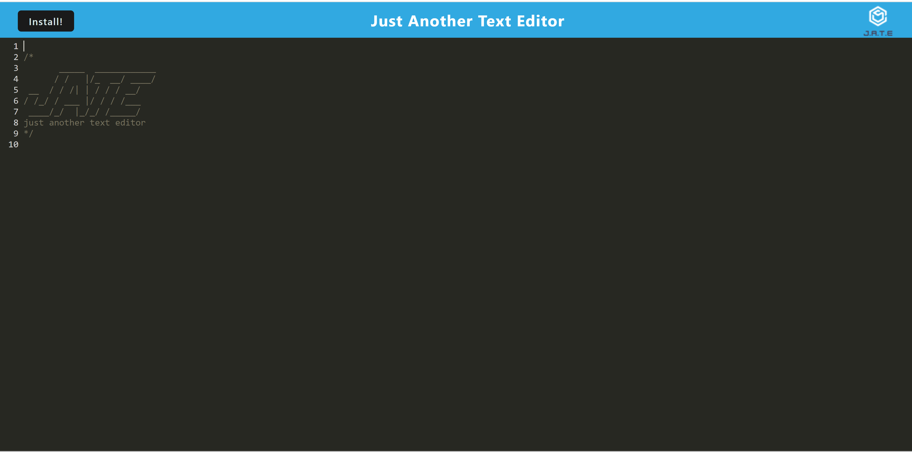
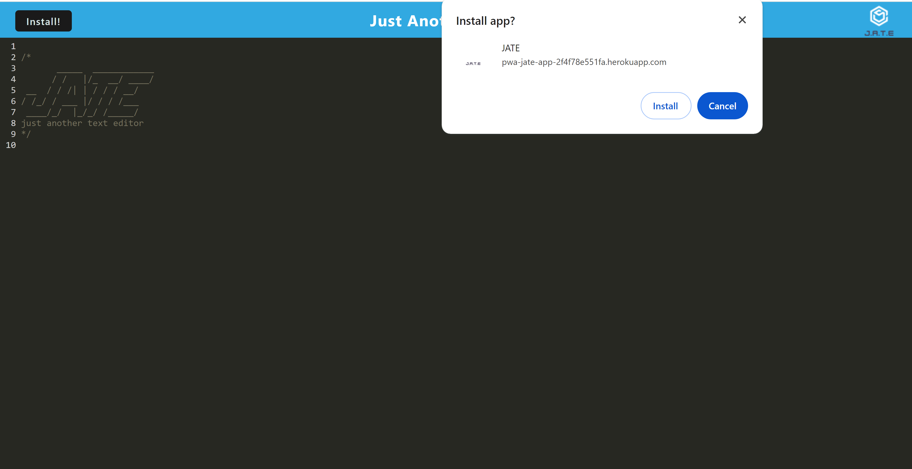
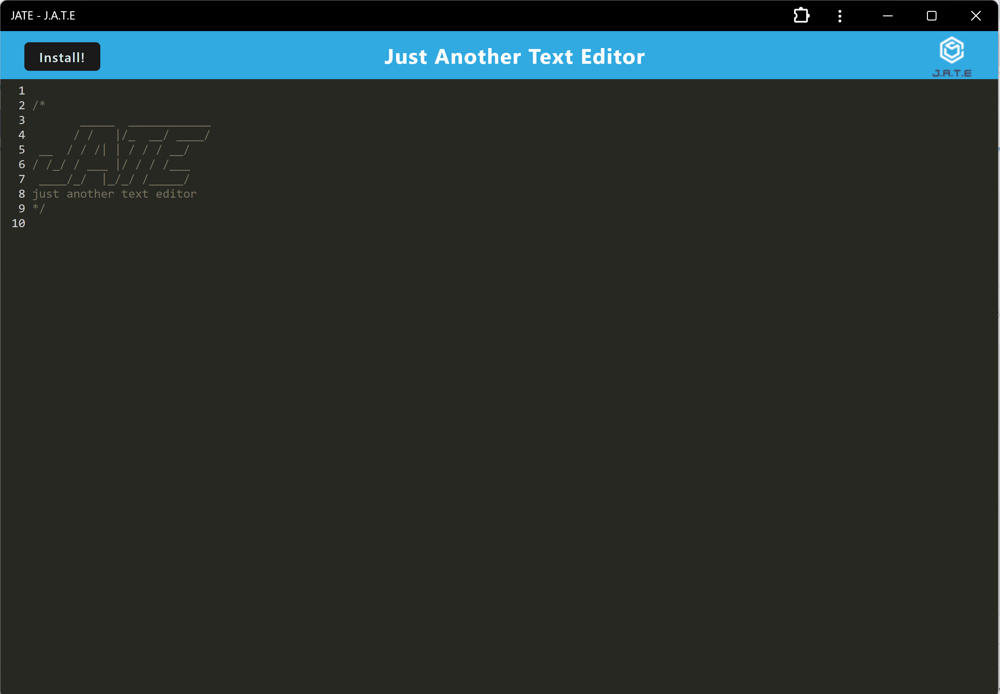

# Notepad--

[Live Deployed Application](https://pwa-jate-app-2f4f78e551fa.herokuapp.com/)


## Description

As a developer it is important to understand how to use webpack and service workers in order to create an installable application that functions to keep notes or edit text. The application uses the JATE UI, and serves to be a very simplistic 

## Table of contents

- [Installation](#installation)
- [Usage](#usage)
- [Collaborators](#collaborators)
- [Questions](#questions)

## Installation

1. Clone the repository from `GitHub`
2. Install or have `Node.js`, installed.
3. Open the project inside the root integrated terminal.
4. Use the command `npm i` to install all package dependencies.

## Packages that will be installed

```
- express
- babel-loader
- css-loader
- style-loader
- @babel/core
- @babel/plugin-proposal-object-rest-spread
- @babel/plugin-transform-runtime
- @babel/preset-env
- @babel/runtime
- html-webpack-plugin
- http-server
- webpack
- webpack-cli
- webpack-dev-server
- webpack-pwa-manifest
- workbox-webpack-plugin
```

## Usage

1. Start the application using the command `npm run start` in the root terminal.
2. Open your default browser and head to `localhost:3000`.
3. Click the `Install` button in the top left, where a prompt with the option to `Cancel` or `Install` the applicaiton will appear.
4. After installation, a desktop icon should appear for the application.
5. Click the desktop icon to start the application.
6. Features include offline editing, persistent content, and integrated service workers.'

### Website Application Page



### Install Prompt



### Installed Application



## Collaborators

Starter code provided by [Dev Boot Camp](https://github.com/coding-boot-camp/cautious-meme)

## Questions

You are welcome to contact me with questions using the following:

- [GitHub Profile](https://github.com/ecsroka13)

- [Email](mailto:ethansroka@gmail.com)